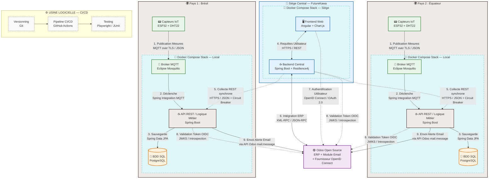

```mermaid
graph TB
    %% ── Style definitions ──────────────────────────────
    classDef hq fill:#e3f2fd,stroke:#1565c0,stroke-width:2px;
    classDef local fill:#efebe9,stroke:#4e342e,stroke-width:2px;
    classDef hardware fill:#e8f5e9,stroke:#2e7d32,stroke-width:2px;
    classDef db fill:#fff3e0,stroke:#ef6c00,stroke-width:2px;
    classDef erp fill:#f3e5f5,stroke:#7b1fa2,stroke-width:2px;
    classDef docker fill:#e0f7fa,stroke:#00acc1,stroke-width:1px,stroke-dasharray: 5 5;
    classDef devops fill:#fafafa,stroke:#424242,stroke-width:1px,stroke-dasharray: 3 3;

    %% ════════════════════════════════════════════════════
    %% PAYS 2 — ÉQUATEUR
    %% ════════════════════════════════════════════════════
    subgraph Pays2 [🌍 Pays 2 : Équateur]
        direction TB
        IoT2[📟 Capteurs IoT<br>ESP32 + DHT22]:::hardware

        subgraph DockerLocal2 [🐳 Docker Compose Stack — Local]
            Broker2[📡 Broker MQTT<br>Eclipse Mosquitto]:::hardware
            API2[☕ API REST / Logique Métier<br>Spring Boot]:::local
            DB2[(🐘 BDD SQL<br>PostgreSQL)]:::db
        end
    end

    %% ════════════════════════════════════════════════════
    %% SIÈGE CENTRAL
    %% ════════════════════════════════════════════════════
    subgraph Siege [🏢 Siège Central — FutureKawa]
        direction TB
        subgraph DockerSiege [🐳 Docker Compose Stack — Siège]
            Frontend[🖥️ Frontend Web<br>Angular + Chart.js]:::hq
            BackendCentral[☕ Backend Central<br>Spring Boot + Resilience4j]:::hq
        end
    end

    %% ════════════════════════════════════════════════════
    %% PAYS 1 — BRÉSIL
    %% ════════════════════════════════════════════════════
    subgraph Pays1 [🌍 Pays 1 : Brésil]
        direction TB
        IoT1[📟 Capteurs IoT<br>ESP32 + DHT22]:::hardware

        subgraph DockerLocal1 [🐳 Docker Compose Stack — Local]
            Broker1[📡 Broker MQTT<br>Eclipse Mosquitto]:::hardware
            API1[☕ API REST / Logique Métier<br>Spring Boot]:::local
            DB1[(🐘 BDD SQL<br>PostgreSQL)]:::db
        end
    end

    %% ════════════════════════════════════════════════════
    %% ODOO — ERP + AUTH + EMAIL
    %% ════════════════════════════════════════════════════
    Odoo[🟣 Odoo Open Source<br>ERP + Module Email<br>+ Fournisseur OpenID Connect]:::erp

    %% ════════════════════════════════════════════════════
    %% CI / CD
    %% ════════════════════════════════════════════════════
    subgraph DevOps [⚙️ USINE LOGICIELLE — CI/CD]
        direction LR
        Git[Versionning<br>Git]:::devops
        GithubActions[Pipeline CI/CD<br>GitHub Actions]:::devops
        Tests[Testing<br>Playwright / JUnit]:::devops
        Git --> GithubActions --> Tests
    end

    %% ── Flux IoT interne au pays ───────────────────────
    IoT2 -->|1. Publication Mesures<br>MQTT over TLS / JSON| Broker2
    Broker2 -->|2. Déclenche<br>Spring Integration MQTT| API2
    API2 -->|3. Sauvegarde<br>Spring Data JPA| DB2

    IoT1 -->|1. Publication Mesures<br>MQTT over TLS / JSON| Broker1
    Broker1 -->|2. Déclenche<br>Spring Integration MQTT| API1
    API1 -->|3. Sauvegarde<br>Spring Data JPA| DB1

    %% ── Flux inter-réseaux (central ↔ local) ──────────
    Frontend <-->|4. Requêtes Utilisateur<br>HTTPS / REST| BackendCentral
    BackendCentral -.->|5. Collecte REST synchrone<br>HTTPS / JSON + Circuit Breaker| API2
    BackendCentral -.->|5. Collecte REST synchrone<br>HTTPS / JSON + Circuit Breaker| API1

    %% ── Odoo — ERP / Métier ────────────────────────────
    BackendCentral <-->|6. Intégration ERP<br>XML-RPC / JSON-RPC| Odoo

    %% ── Odoo — Authentification OpenID Connect ─────────
    Frontend -.->|7. Authentification Utilisateur<br>OpenID Connect / OAuth 2.0| Odoo
    BackendCentral -.->|8. Validation Token OIDC<br>JWKS / Introspection| Odoo
    API2 -.->|8. Validation Token OIDC<br>JWKS / Introspection| Odoo
    API1 -.->|8. Validation Token OIDC<br>JWKS / Introspection| Odoo

    %% ── Odoo — Envoi Email (alertes) ───────────────────
    API2 -->|9. Envoi Alerte Email<br>via API Odoo mail.message| Odoo
    API1 -->|9. Envoi Alerte Email<br>via API Odoo mail.message| Odoo

    %% ── Application des styles de sous-graphes ─────────
    class Pays2,Pays1 local;
    class Siege hq;
    class DockerLocal2,DockerLocal1,DockerSiege docker;
```