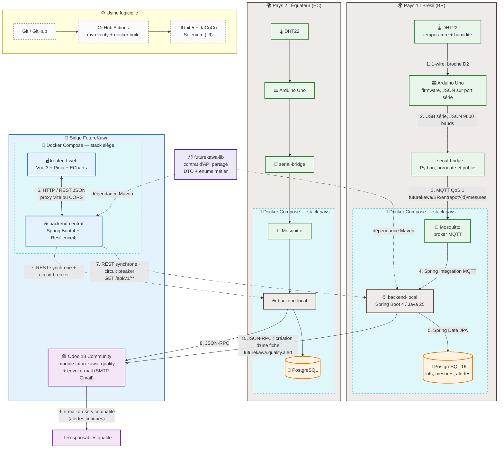

# Architecture applicative — FutureKawa

> État du système au 27/08/2026. Ce document décrit l'architecture **réellement
> implémentée**, pas une cible. Les écarts connus et les évolutions prévues sont
> listés en §7.

## 1. Vue d'ensemble



## 2. Composants

| Composant | Technologie | Rôle |
| --- | --- | --- |
| `iot/arduino-uno` | Arduino Uno + DHT22, C++ | Lit température/humidité, imprime une ligne JSON par mesure sur le port série. |
| `iot/serial-bridge` | Python + paho-mqtt | L'Uno n'a pas de carte réseau : le pont lit le port série, horodate, et publie en MQTT. Tourne sur l'hôte du pays. |
| Mosquitto | Eclipse Mosquitto 2 | Broker MQTT local au pays. Ingestion interne, non exposée. |
| `backend-local` | Spring Boot 4.0.6, Java 25 | Un déploiement par pays. Ingestion MQTT, persistance, règles d'alerte, API REST `/api/v1`. |
| PostgreSQL | PostgreSQL 16 | Une base par pays (lots, mesures de stockage, alertes). |
| `backend-central` | Spring Boot 4.0.6 + Resilience4j | Agrège les backends pays, regroupe par `codePays`, expose une API unique au frontend. |
| `frontend-web` | Vue 3, Pinia, Vue Router, ECharts, Vite | Poste de supervision siège : tableau de bord, lots FIFO, courbes, alertes. |
| `futurekawa-lib` | Java, records + enums | **Contrat d'API partagé** entre les deux backends (voir §5). |
| Odoo | Odoo 18 Community, module `futurekawa_quality` | Fiches de non-conformité qualité, workflow d'état, envoi e-mail sur alerte critique. |
| CI | GitHub Actions | `mvn verify` sur le réacteur Maven + build des images Docker + lint/build du frontend. |

## 3. Flux

1. **Acquisition** (interne au pays) : DHT22 → Arduino Uno → pont série Python → Mosquitto → `backend-local` → PostgreSQL. Topic : `futurekawa/{codePays}/entrepot/{idEntrepot}/mesures`, charge utile `{ id_capteur, temperature_c, humidite_pourcent, timestamp }` (epoch millisecondes) — l'identifiant d'entrepôt vient du topic, pas du corps.
2. **Détection** : à chaque mesure, `MesureService` compare la valeur aux seuils du pays (`PaysProperties`, injectés par `.env`). Hors tolérance → `AlerteService` ouvre une alerte `CONDITION_NON_IDEALE` (avec déduplication : pas de seconde alerte ouverte pour le même entrepôt). Un `@Scheduled` horaire lève les alertes `LOT_TROP_ANCIEN` au-delà de 365 jours de stockage.
3. **Notification** : `backend-local` pousse la fiche dans Odoo en JSON-RPC. Odoo est responsable de l'e-mail : le `mail.template` n'est déclenché que pour les alertes de niveau `CRITIQUE`, et les destinataires sont résolus dynamiquement par le tag de contact « Responsable Qualite FutureKawa » (aucune adresse en dur dans le code).
4. **Consolidation** : le frontend n'interroge que `backend-central`, qui fait un **fan-out parallèle** vers les backends pays et enveloppe chaque réponse dans son groupe pays.
5. **Écritures** : création de lot et changement de statut passent par le central, qui relaie vers le bon pays selon `codePays`. Le backend local reste la source de vérité du cycle de vie des alertes ; la clôture d'une alerte est répercutée dans Odoo (sens local → Odoo uniquement).

## 4. Choix d'architecture argumentés

### Stabilité

- **Isolation des pannes par pays** : un `CircuitBreaker` Resilience4j par `codePays`. Si un pays ne répond pas (circuit ouvert, timeout, erreur réseau), il est simplement **omis** de la réponse consolidée, qui reste `200 OK` ; les pays absents sont signalés par l'en-tête `X-Unavailable-Countries` et affichés en bandeau par le frontend. Une panne au Brésil ne prive pas le siège des données équatoriennes.
- **Autonomie du pays** : chaque stack pays possède son broker et sa base. La perte du lien avec le siège n'interrompt ni l'acquisition, ni la détection d'alerte, ni l'alimentation d'Odoo.
- **Contrat d'erreur homogène** : les deux backends renvoient du RFC 7807 `application/problem+json`.
- **Redémarrage automatique** : `restart: unless-stopped` et `healthcheck` sur les conteneurs applicatifs.

### Efficacité

- **Fan-out parallèle** sur threads virtuels (Java 25, `newVirtualThreadPerTaskExecutor`) : la latence d'une requête consolidée est celle du pays le plus lent, pas la somme des pays.
- **Timeouts courts** vers les backends pays (2 s connexion / 5 s lecture) pour éviter qu'un pays lent bloque la page.
- **Pagination bornée** : `default-page-size: 20`, `max-page-size: 100`, appliquée dans chaque pays — un paramètre `size` abusif ne peut pas déclencher une lecture non bornée en base.
- **Chargement JPA maîtrisé** : `@EntityGraph` sur les requêtes de liste pour éviter le N+1.

### Pérennité

- **Un seul code source pour N pays** : la configuration pays (seuils, tolérances, identité, connexions) est entièrement externalisée en `.env`. Ouvrir un quatrième pays = un fichier d'environnement et une entrée dans le registre du central, pas une ligne de code.
- **Contrat d'API partagé** (`futurekawa-lib`) : les DTO et enums échangés existent en **un seul exemplaire** compilé, consommé par les deux services. Une divergence de champ devient une erreur de compilation au lieu d'un bug d'intégration.
- **Vocabulaire métier unique** : noms d'entités, de champs, valeurs d'enums et routes suivent `GLOSSAIRE.md`. Convention de langue : **français pour le domaine, anglais pour le code** (commentaires, messages techniques).
- **Découverte des pays** : le central interroge périodiquement `GET /api/v1/pays` de chaque backend pour récupérer nom et seuils — l'ajout d'un pays ne demande pas de redéploiement du frontend.

## 5. Structure de build (réacteur Maven)

```text
pom.xml                 ← futurekawa-parent : agrégateur + configuration commune
├── futurekawa-lib/     ← contrat partagé (DTO + enums), sans Spring ni JPA
├── backend-local/      ← dépend de futurekawa-lib
└── backend-central/    ← dépend de futurekawa-lib
```

`mvn clean verify` à la racine construit les trois modules, exécute les 68 tests de
`backend-local` et applique sa barrière de couverture JaCoCo à 80 %.

**Règle de périmètre de la librairie** : un type ne monte dans `futurekawa-lib` que si
**les deux** services Java l'utilisent. Restent donc hors librairie les enveloppes de
consolidation propres au central (`CountryGroup`, `CountryPageGroup`, `PageDto`), les
entités JPA du local, et `MqttMesurePayload` (format de fil MQTT, pas contrat REST).

Conséquence sur les images Docker : les `Dockerfile.prod` se construisent depuis la
**racine du dépôt** (`context: ..`), car un service seul ne suffit plus à se compiler.

## 6. Sécurité

- **Aucune authentification applicative**, ni sur `backend-local` ni sur `backend-central`.
  Décision assumée pour cette phase : la solution est déployée sur le réseau privé du
  siège et des sites, sans exposition publique. Les backends pays sont des services
  machine-to-machine appelés uniquement par le central.
- La protection repose sur le **niveau réseau/service** : réseau privé, et pour l'accès
  distant de démonstration, un tunnel Cloudflare avec une politique Cloudflare Access
  devant l'API du mini-PC.
- **CORS** est le seul contrôle applicatif côté central (`futurekawa.cors.allowed-origins`),
  nécessaire uniquement quand le frontend est servi depuis une autre origine ; en
  développement le proxy Vite place frontend et API sur la même origine.
- L'écran de connexion du frontend est une **identification de poste** volontairement non
  authentifiante (il nomme l'opérateur pour l'affichage). L'authentification utilisateur et
  le RBAC sont identifiés comme un chantier de la phase suivante.
- Les secrets (mots de passe base, clé d'API Odoo, mot de passe d'application SMTP) vivent
  exclusivement dans des fichiers `.env` non versionnés et dans Odoo.

## 7. Écarts connus et évolutions prévues

| Sujet | État |
| --- | --- |
| Authentification utilisateur / RBAC | Non implémentée (voir §6). Chantier phase 2. |
| Alerting via le central (`local → central → Odoo`) | Non fait. Aujourd'hui chaque pays parle directement à Odoo. Plan détaillé : `backend-local/migration-alerting-to-backend-central-plan.md`. |
| Retour Odoo → backend (boutons Valider / Analyser / Déclasser) | Non fait. La synchronisation d'état est à sens unique (local → Odoo). |
| Module Odoo `futurekawa_inventory` (moteur FIFO) | Non implémenté. Spécifié dans `odoo/implementation_plan.md`. |
| Tests de `backend-central` | Aucun. Le plugin JaCoCo est en place mais sans barrière, faute de tests. |
| Filtres et tri côté backend pays | `statutLot`, `statutAlerte`, `typeAlerte`, `from`/`to` sont transmis par le central mais ignorés par le local ; le tri FIFO n'est pas appliqué par défaut sur les endpoints de liste. Le filtrage est fait côté frontend. |
| Multi-pays simultané sur un même hôte | `docker-compose.prod.yml` fixe les noms de conteneurs et les ports : lancer BR, EC et CO sur la même machine demande de paramétrer projet et ports. |
| Bus d'événements inter-sites (MQTT bridge) | Documenté comme cible de production, non construit. |
