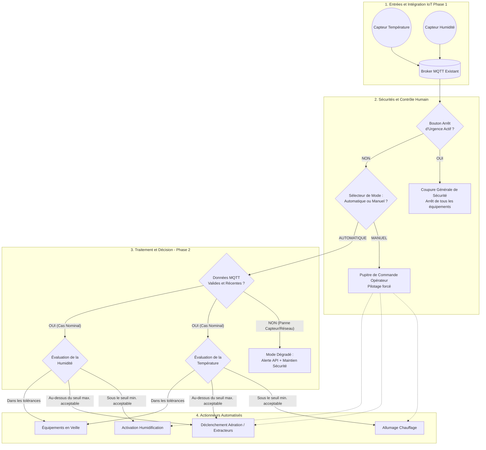

# Cadrage Phase 2 : Automatisation des Entrepôts

```mermaid
graph TD
    %% Entrées et Intégration IoT
    subgraph Entrees [1. Entrées et Intégration IoT Phase 1]
        Capteur_T((Capteur Température))
        Capteur_H((Capteur Humidité))
        Broker_MQTT[(Broker MQTT Existant)]
    end

    %% Sécurités Matérielles et Logiques
    subgraph Securites [2. Sécurités et Contrôle Humain]
        AU{Bouton Arrêt<br/>d'Urgence Actif ?}
        Mode{Sélecteur de Mode :<br/>Automatique ou Manuel ?}
        Coupure[Coupure Générale de Sécurité<br/>Arrêt de tous les équipements]
        Ctrl_Manuel[Pupitre de Commande Opérateur<br/>Pilotage forcé]
    end

    %% Unité de Traitement et Décision
    subgraph Traitement [3. Traitement et Décision - Phase 2]
        Valid_Donnees{Données MQTT<br/>Valides et Récentes ?}
        Cas_Degrade[Mode Dégradé :<br/>Alerte API + Maintien Sécurité]
        
        Eval_T{Évaluation de la<br/>Température}
        Eval_H{Évaluation de la<br/>Humidité}
    end

    %% Actionneurs
    subgraph Actionneurs [4. Actionneurs Automatisés]
        Act_Chauffage[Allumage Chauffage]
        Act_Aeration[Déclenchement Aération / Extracteurs]
        Act_Humidification[Activation Humidification]
        Standby[Équipements en Veille]
    end

    %% --- LIAISONS ET FLUX LOGIQUES ---
    
    %% Flux IoT
    Capteur_T --> Broker_MQTT
    Capteur_H --> Broker_MQTT
    Broker_MQTT --> AU

    %% Logique de Sécurité (Priorité Absolue)
    AU -- OUI --> Coupure
    AU -- NON --> Mode

    %% Logique de Mode (Manuel / Auto)
    Mode -- MANUEL --> Ctrl_Manuel
    Ctrl_Manuel -.-> Act_Chauffage
    Ctrl_Manuel -.-> Act_Aeration
    Ctrl_Manuel -.-> Act_Humidification

    Mode -- AUTOMATIQUE --> Valid_Donnees

    %% Logique de Cas Dégradé vs Nominal
    Valid_Donnees -- NON (Panne Capteur/Réseau) --> Cas_Degrade
    Valid_Donnees -- OUI (Cas Nominal) --> Eval_T
    Valid_Donnees -- OUI (Cas Nominal) --> Eval_H

    %% Règles de Décision Température
    Eval_T -- Sous le seuil min. acceptable --> Act_Chauffage
    Eval_T -- Au-dessus du seuil max. acceptable --> Act_Aeration
    Eval_T -- Dans les tolérances --> Standby

    %% Règles de Décision Humidité
    Eval_H -- Sous le seuil min. acceptable --> Act_Humidification
    Eval_H -- Au-dessus du seuil max. acceptable --> Act_Aeration
    Eval_H -- Dans les tolérances --> Standby
```
